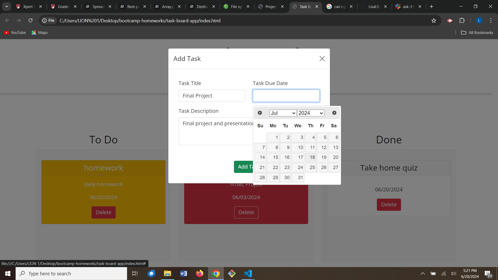
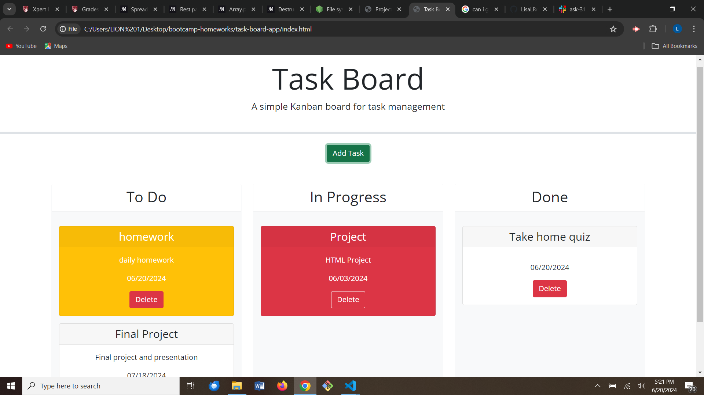

# Task Board App

## Description

This is a task management application that allows the user to create tasks with due dates. The user is then able to organize them to different task boards depending on their status.

## Usage

The user may create a task by clicking on "Add Task" and entering a title, due date, and description. The task will appear red if it is past-due, yellow if it is due today, and white if it is due in the future. The task may then be placed on the "To Do", "In Progress", or "Done" board. It may also be deleted at any time.

## Link

https://lisalreynolds.github.io/task-board-app/
